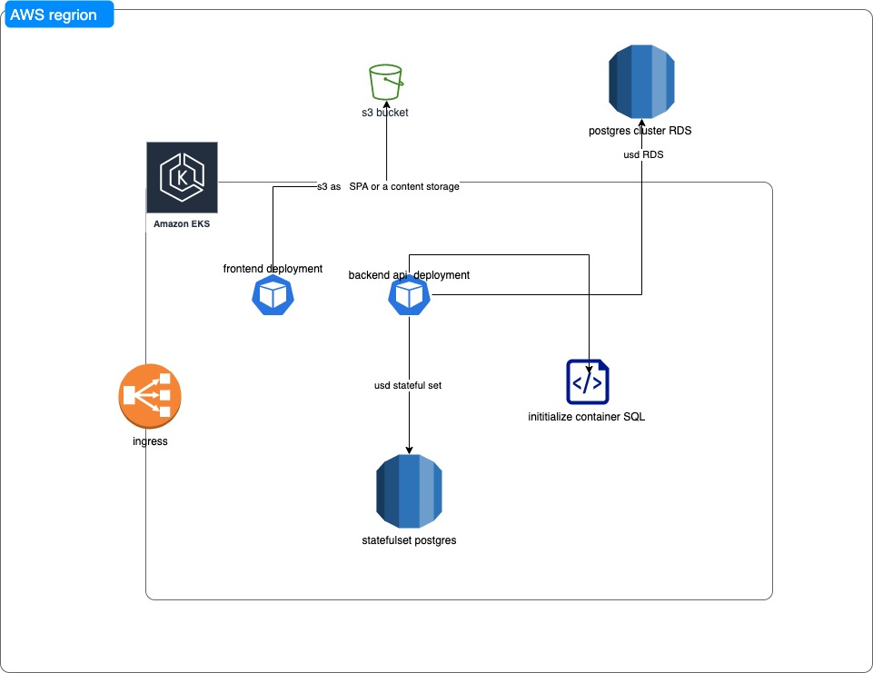

# Truvity

truvity

## Installation

install or run it as is 

```bash
go run main.go

go build 
```

## Usage

```go 
 marc@Marcs-MacBook-Pro  ~/workspace/exam/truvity: go run main.go                                                                                                 
input number of websites! type "done" if finish 
https://google.com
https://yahoo.com
done ## type "done" 
Website will output in a descending order according to body size:
https://yahoo.com 843020
https://google.com 14832
```

## diagram 



Explanation:
    if its in the AWS architecture, we will need EKS cluster to create the resources needed
    - there are 2 option host the SPA in s3 with cloudfront or as a deployment in kubernetes 
    - backend api will be in kubernetes deployment with 2 containers as init container for SQL script  then the main container
    - job container to load binary fixture 
    - for postgres we have 2 option 1 for rds cluster or the statefulset inside kubernetes
    - external data provider(????) if the api backend will query this ?
    


## Contributing
Pull requests are welcome. For major changes, please open an issue first to discuss what you would like to change.

Please make sure to update tests as appropriate.

## License
[MIT](https://choosealicense.com/licenses/mit/)